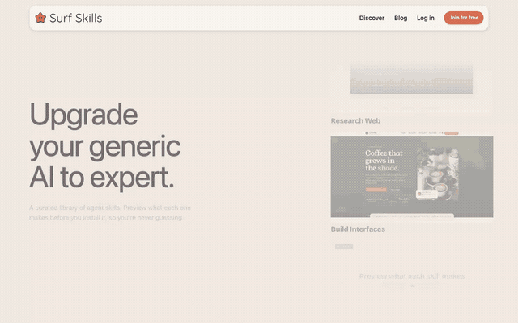

# Surf Skills

**[surfskills.surf](https://surfskills.surf)** — a curated directory of
open-source AI agent skills, each shown actually working. Preview what a skill
makes before you install it, so you're never guessing.



## Quick start

```bash
npm install
cp .env.example .env             # public config
cp .dev.vars.example .dev.vars   # secret keys — never commit
npm run dev
```

## License

[MIT](LICENSE)
